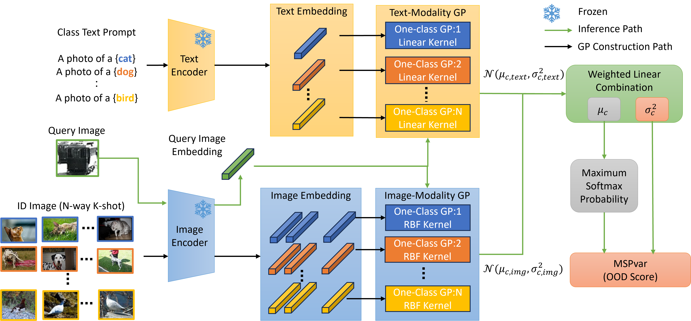

# GP-Adapter: Gaussian Process CLIP-Adapter for Few-Shot OOD Detection (IJCNN2026)

This repository is official PyTorch implementation of the paper "GP-Adapter: Gaussian Process CLIP-Adapter for Few-Shot OOD Detection" accepted in International Joint Conference on Neural Networks (IJCNN) 2026.

<div align="center">
  
</div>

## Paper
- PDF Link: TBD
### Abstract
> We propose GP-Adapter, a training-free framework that augments CLIP (Contrastive Language-Image Pre-training) with Gaussian Process (GP) uncertainty modeling for few-shot classification and out-of-distribution (OOD) detection. While CLIP achieves strong zero-shot recognition, it yields deterministic similarity scores and offers limited uncertainty information, which is critical under distribution shift and data scarcity. GP-Adapter constructs modality-specific, class-wise one-class GPs on top of frozen CLIP embeddings using an RBF kernel for image features and a linear kernel for text prompts and fuses their predictive statistics to produce a variance-aware confidence score for OOD detection. The method requires no fine-tuning of the CLIP backbone and relies only on a small K-shot cache and lightweight hyperparameter selection, with memory cost scaling as O(CK^2) for C classes and K shots. Experiments on ImageNet and multiple OOD benchmarks show that GP-Adapter provides competitive few-shot performance and consistently improves OOD detection when combined with prompt-learning baselines, highlighting the complementarity between GP-based uncertainty modeling and prompt learning. Overall, our results suggest that integrating probabilistic inference with large pre-trained vision-language models can improve reliability in low-data and distribution-shifted settings.

## Setup
The experiment was run in the following environment: Python 3.10.10, CUDA 12.1, `torch==2.5.1`, `torchvision==0.20.1`, and `gpytorch==1.14`.

```bash
python -m venv .venv
source .venv/bin/activate
pip install -r requirements.txt
```

## Datasets
For ID datasets, we use ImageNet-1k or ImageNet-100. For OOD datasets, we use iNaturalist, SUN, Places, and Texture. The directory structure is followed by https://github.com/AtsuMiyai/LoCoOp.

For ImageNet-style datasets, pass the actual directory name under `--root-path` via `--data-dir-name` (for example `ILSVRC2012` or `imagenet`). ImageNet-100 reuses the ImageNet-1k directory and filters it down to 100 classes, so it should generally use the same underlying directory name.

## Few-Shot Adaptation and Evaluation
Single-run examples:

`GP-Adapter` with an explicit few-shot manifest:
```bash
python main_gpy_imagenet.py   --config datasets/configs/imagenet.yaml   --trainer NoPrompt   --backbone "ViT-B/16"   --seed 1   --root-path /path/to/datasets   --root-path-ood /path/to/ood_datasets   --data-dir-name ILSVRC2012   --selected-shots-json /path/to/selected_shots.json
```

`GP-Adapter+CoOp` with prompt-learning outputs:
```bash
python main_gpy_imagenet.py   --config datasets/configs/imagenet.yaml   --trainer CoOp   --backbone "ViT-B/16"   --seed 1   --root-path /path/to/datasets   --root-path-ood /path/to/ood_datasets   --data-dir-name ILSVRC2012   --locoop-output-root /path/to/output_locoop   --locoop-config-dir /path/to/locoop_configs
```

`GP-Adapter+LoCoOp` with prompt-learning outputs:
```bash
python main_gpy_imagenet.py   --config datasets/configs/imagenet.yaml   --trainer LoCoOp   --backbone "ViT-B/16"   --seed 1   --root-path /path/to/datasets   --root-path-ood /path/to/ood_datasets   --data-dir-name ILSVRC2012   --locoop-output-root /path/to/output_locoop   --locoop-config-dir /path/to/locoop_configs
```

Sweep seed, model and dataset:
```bash
DATA_ROOT=/path/to/datasets OOD_DATA_ROOT=/path/to/ood_datasets bash scripts/run_imagenet_sweep.sh
```

Notes:
- `manifests/` stores trainer-independent `selected_shots.json` files shared by `NoPrompt`, `CoOp`, and `LoCoOp`. ImageNet manifests are canonicalized under `manifests/imagenet`.
- `--selected-shots-json` can still be used to override a specific manifest directly.
- `NoPrompt` only needs a manifest. `CoOp` and `LoCoOp` need a manifest plus prompt checkpoints under `--locoop-output-root`.
- Logs are written under `logs/` by default (configure with `--log-dir`).

## LoCoOp Dependency
Prompt-learning baselines are loaded from external training outputs. See `manifests/README.md` for shared split manifests and `external/README.md` for prompt checkpoint layout.
- LoCoOp repository: https://github.com/AtsuMiyai/LoCoOp

If you want to regenerate the shared few-shot manifests from CoOp/LoCoOp training, use the following procedure:
1. Replace LoCoOp's `datasets/imagenet.py` with `patches/imagenet.py`.
2. Run CoOp or LoCoOp training in the LoCoOp repository.
3. Copy the resulting experiment directory under `external/locoop_outputs/`.
4. Copy the exported `selected_shots.json` files from those outputs into the matching locations under `manifests/`.

At inference time, GP-Adapter reads the shared split from `manifests/`. `CoOp` and `LoCoOp` additionally read prompt checkpoints from `external/locoop_outputs/`.
For the prompt-learning baselines, we used the default CoOp/LoCoOp hyperparameters. The only change was for ImageNet-100, where `topk` was set to `20`.

## Pretrained Weights of LoCoOp and CoOp
- TBD

## License
Please see `LICENSE`.